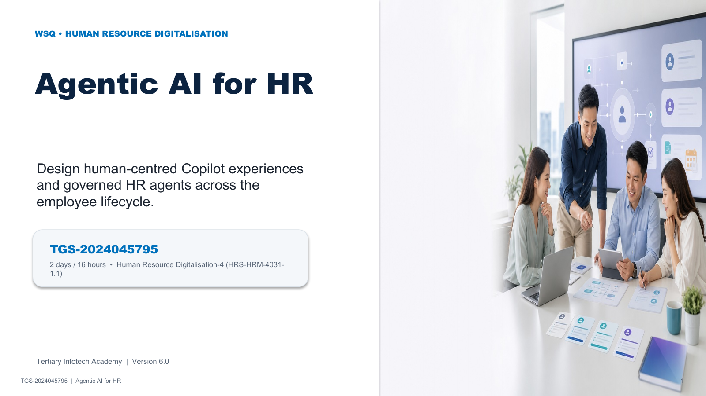

# Agentic AI for HR

WSQ courseware for **TGS-2024045795 — Agentic AI for HR**.

This two-day course uses Microsoft 365 Copilot for generative-AI work and Agent Builder for Microsoft 365 Copilot or Microsoft Copilot Studio for governed agentic-AI workflows.

## Learner resources

- `courseware/` — trainer slides, Learner Guide and Lesson Plan
- `activities/` — 12 self-contained, synthetic real-work HR cases with detailed Markdown instructions and evidence workbooks
- `SOURCE-COVERAGE.md` — source and coverage traceability
- `QA-REPORT.md` — build and alignment evidence

## HR lifecycle coverage

Workforce planning, job design, recruitment, resume screening, interviewing, policy, onboarding, leave, benefits, payroll enquiries, performance, learning, internal mobility, engagement, employee service, employee relations triage, offboarding and HR-agent operations.

## Data safety

All learner cases, names, resumes and operational records are fictional. Do not upload live employee, candidate or company-confidential data to a learning environment.

Course page: <https://www.tertiarycourses.com.sg/wsq-agentic-ai-for-hr.html>
