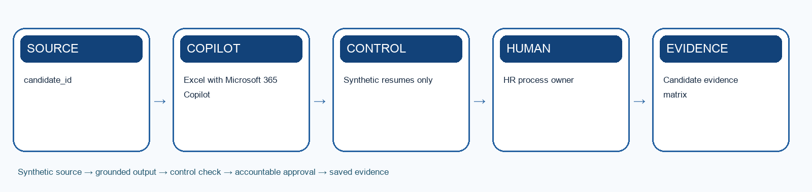

# Lab 3: Screen Resumes with a Fair Evidence Matrix

> **Synthetic learning case:** Do not upload live employee or candidate data.

## Scenario

Six synthetic candidates apply for the Workforce Operations Analyst role from Lab 2. Recruiters currently scan resumes inconsistently and retype evidence into spreadsheets.

## Learning goal

Use Microsoft 365 Copilot to extract job-related evidence at speed while keeping shortlist decisions human, traceable and reviewable.

## Microsoft tools

- Excel with Microsoft 365 Copilot
- Word

## Supplied mock data

Use `mock-data.csv` or the **Mock Data** sheet in `Lab-03-Evidence-Workbook.xlsx`. The records are specific to this scenario and carry forward the HarbourLight case.

## Guardrails

- Synthetic resumes only
- Protected attributes and proxies excluded
- AI may organise evidence but cannot reject a candidate

## Detailed procedure

1. Load the approved JD and anchored rubric from Lab 2 or use the supplied fallback rubric.
2. Review the six synthetic resumes without adding new criteria.
3. Prompt Copilot to extract evidence for each criterion and mark missing information as unknown.
4. Verify every extracted item against the source resume.
5. Calculate rubric results using transparent workbook formulas.
6. Check for proxy variables, inconsistent standards and false negative risk.
7. Record the authorised recruiter's shortlist decision separately from AI output.
8. Pass the shortlisted evidence and unresolved questions to Lab 4.

## Product workbench

1. Sign in with the licensed training account. Use only the supplied synthetic `mock-data.csv` or evidence workbook; do not paste live HR records.
2. Open `Lab-03-Evidence-Workbook.xlsx`, inspect the Mock Data sheet and record the meaning of `candidate_id` and `skills_evidence` before prompting.
3. Save a working copy of the workbook in the approved OneDrive or SharePoint training location. In Excel, make the source range a named Table with headers, then open Copilot from the ribbon.
4. Ask Copilot to use the named table and cite `candidate_id` for each finding. Request an output table with evidence, uncertainty and an HR reviewer action.
5. Compare at least three claims with the original CSV rows. Write corrections and the exact prompt in the Evidence Log; do not treat a Copilot chart or summary as a final decision.

Microsoft product reference: https://support.microsoft.com/en-us/copilot-excel

## Prompt scaffold

> You are supporting the HarbourLight Logistics SG training case. Use only the supplied synthetic evidence. Your task is to use microsoft 365 copilot to extract job-related evidence at speed while keeping shortlist decisions human, traceable and reviewable. State assumptions; cite record IDs or approved source sections; separate observation from inference; flag missing information; list the human checks and approvals required before use.

## Evidence checklist

- [ ] Candidate evidence matrix
- [ ] Uncertainty and bias log
- [ ] Human shortlist rationale
- [ ] Evidence workbook records the input/source, prompt or decision, output, verification, revision and owner.
- [ ] A peer or trainer can reproduce the reasoning from the saved evidence.

## Acceptance criteria

- Synthetic resumes only
- Protected attributes and proxies excluded
- AI may organise evidence but cannot reject a candidate
- The output is accurate, traceable, usable and explicit about uncertainty.
- Consequential decisions and actions remain with an authorised human.

## Scenario questions

1. Where could absence of evidence become an unfair negative assumption?
2. How can a candidate challenge or correct the evidence?
3. Which screening error creates the greatest harm?

## Submission naming

`L03-<YourName>-Evidence.xlsx` plus the listed deliverables.

## Source anchors

- Course source register: `../SOURCE-COVERAGE.md`
- Microsoft capability boundary: Microsoft 365 Copilot for generative work; Agent Builder or Copilot Studio for agentic work.

## Recommended team roles and timing

- **HR process owner:** confirms that the output solves the stated screen resumes with a fair evidence matrix outcome and remains consistent with approved policy.
- **AI operator or maker:** records the exact prompt, instructions, knowledge sources, tool choices and revisions.
- **Reviewer or approver:** independently checks evidence, permissions, fairness, privacy and any consequential action.
- **Evidence recorder:** keeps the workbook complete enough for another person to reproduce the reasoning.

Allow about 35–50 minutes for the first build, 15 minutes for testing and verification, and 10 minutes for peer challenge and reflection. The trainer may adjust the timing to fit the delivery mode.

## Test-it evidence

Record test ID, input, expected result, actual result, source citation, reviewer and pass/fail in the evidence workbook. For agent labs, use `agent-test-cases.csv` and capture the test conversation or run result before marking a case complete.

## Verification method

1. Compare every factual statement or extracted item with the supplied source record.
2. Mark missing information as unknown; do not convert absence into a negative assumption.
3. Check that personal data, tool access and sharing are limited to the stated purpose.
4. Test one normal case, one ambiguous case, one out-of-scope case and one failure or exception.
5. Ask a peer to challenge the decision, then record whether you accepted or rejected the challenge and why.
6. Confirm the named human owner can correct, stop or reverse the work before submission.

## Troubleshooting and recovery

- If Copilot invents evidence, narrow the prompt to named files, tables or record IDs and request citations.
- If an agent answers outside scope, strengthen instructions, remove inappropriate knowledge or tools, and add an explicit escalation response.
- If a flow fails or repeats an action, do not report success. Preserve the error, check the audit record, use a unique request key, and route the case to the human owner.
- If the output is polished but cannot be traced to evidence, treat it as incomplete and rebuild the evidence chain.
