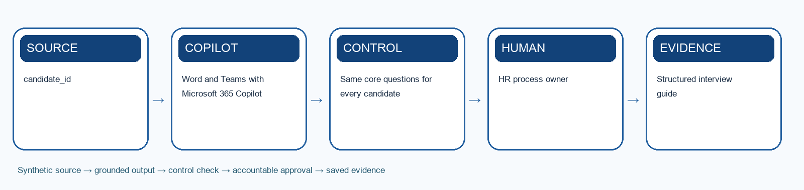

# Lab 4: Prepare and Review Structured Interviews with AI

> **Synthetic learning case:** Do not upload live employee or candidate data.

## Scenario

The recruiter shortlisted three candidates in Lab 3. Managers currently improvise interview questions, take incomplete notes and struggle to compare evidence consistently.

## Learning goal

Use Copilot to prepare job-related structured questions, organise synthetic interview notes and support a human panel decision.

## Microsoft tools

- Word and Teams with Microsoft 365 Copilot
- Excel

## Supplied mock data

Use `mock-data.csv` or the **Mock Data** sheet in `Lab-04-Evidence-Workbook.xlsx`. The records are specific to this scenario and carry forward the HarbourLight case.

## Guardrails

- Same core questions for every candidate
- No emotion or personality inference
- Panel members score independently before consensus

## Detailed procedure

1. Review the JD outcomes, rubric and shortlisted evidence from Labs 2–3.
2. Ask Copilot to draft behavioural questions linked to each job outcome.
3. Create anchored indicators for strong, partial and insufficient evidence.
4. Add accessibility, candidate-consent and prohibited-question checks.
5. Run the supplied synthetic interview transcripts or role-play the panel.
6. Use Copilot to organise notes by criterion without inferring intent, truthfulness or personality.
7. Have panel members score independently, then record evidence-based consensus.
8. Draft consistent offer, hold and decline communications for human approval.

## Product workbench

1. Sign in with the licensed training account. Use only the supplied synthetic `mock-data.csv` or evidence workbook; do not paste live HR records.
2. Open `Lab-04-Evidence-Workbook.xlsx`, inspect the Mock Data sheet and record the meaning of `candidate_id` and `question_id` before prompting.
3. Open Word in the approved Microsoft 365 training account and create a new working document. Open Copilot from the ribbon and attach or reference the approved synthetic brief.
4. Paste the prompt scaffold below. Ask for a structured draft with criterion-to-source citations and a separate UNKNOWN list for unsupported requirements.
5. Track the edits you accept, compare each criterion or question with the source rubric, and ask the HR owner to approve the final version in the evidence workbook.

Microsoft product reference: https://support.microsoft.com/en-us/copilot-word

## Prompt scaffold

> You are supporting the HarbourLight Logistics SG training case. Use only the supplied synthetic evidence. Your task is to use copilot to prepare job-related structured questions, organise synthetic interview notes and support a human panel decision. State assumptions; cite record IDs or approved source sections; separate observation from inference; flag missing information; list the human checks and approvals required before use.

## Evidence checklist

- [ ] Structured interview guide
- [ ] Anchored panel scorecard
- [ ] Candidate communication pack
- [ ] Evidence workbook records the input/source, prompt or decision, output, verification, revision and owner.
- [ ] A peer or trainer can reproduce the reasoning from the saved evidence.

## Acceptance criteria

- Same core questions for every candidate
- No emotion or personality inference
- Panel members score independently before consensus
- The output is accurate, traceable, usable and explicit about uncertainty.
- Consequential decisions and actions remain with an authorised human.

## Scenario questions

1. Which question best tests a role outcome rather than similarity to the panel?
2. What interview evidence should Copilot never infer?
3. How will disagreements between panel members be resolved?

## Submission naming

`L04-<YourName>-Evidence.xlsx` plus the listed deliverables.

## Source anchors

- Course source register: `../SOURCE-COVERAGE.md`
- Microsoft capability boundary: Microsoft 365 Copilot for generative work; Agent Builder or Copilot Studio for agentic work.

## Recommended team roles and timing

- **HR process owner:** confirms that the output solves the stated prepare and review structured interviews with ai outcome and remains consistent with approved policy.
- **AI operator or maker:** records the exact prompt, instructions, knowledge sources, tool choices and revisions.
- **Reviewer or approver:** independently checks evidence, permissions, fairness, privacy and any consequential action.
- **Evidence recorder:** keeps the workbook complete enough for another person to reproduce the reasoning.

Allow about 35–50 minutes for the first build, 15 minutes for testing and verification, and 10 minutes for peer challenge and reflection. The trainer may adjust the timing to fit the delivery mode.

## Test-it evidence

Record test ID, input, expected result, actual result, source citation, reviewer and pass/fail in the evidence workbook. For agent labs, use `agent-test-cases.csv` and capture the test conversation or run result before marking a case complete.

## Verification method

1. Compare every factual statement or extracted item with the supplied source record.
2. Mark missing information as unknown; do not convert absence into a negative assumption.
3. Check that personal data, tool access and sharing are limited to the stated purpose.
4. Test one normal case, one ambiguous case, one out-of-scope case and one failure or exception.
5. Ask a peer to challenge the decision, then record whether you accepted or rejected the challenge and why.
6. Confirm the named human owner can correct, stop or reverse the work before submission.

## Troubleshooting and recovery

- If Copilot invents evidence, narrow the prompt to named files, tables or record IDs and request citations.
- If an agent answers outside scope, strengthen instructions, remove inappropriate knowledge or tools, and add an explicit escalation response.
- If a flow fails or repeats an action, do not report success. Preserve the error, check the audit record, use a unique request key, and route the case to the human owner.
- If the output is polished but cannot be traced to evidence, treat it as incomplete and rebuild the evidence chain.
