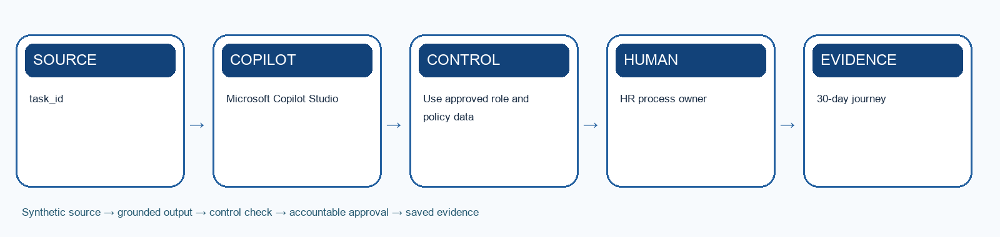

# Lab 5: Automate Onboarding Coordination

> **Synthetic learning case:** Do not upload live employee or candidate data.

## Scenario

A selected synthetic candidate joins HarbourLight as the Workforce Operations Analyst. Equipment, access, safety training and manager check-ins are currently coordinated through emails and spreadsheets, causing missed tasks and repeated follow-up.

## Learning goal

Design a Copilot Studio onboarding agent that coordinates routine work while retaining accountable task owners and human confirmation.

## Microsoft tools

- Microsoft Copilot Studio
- Teams
- SharePoint
- Power Automate or agent flows

## Supplied mock data

Use `mock-data.csv` or the **Mock Data** sheet in `Lab-05-Evidence-Workbook.xlsx`. The records are specific to this scenario and carry forward the HarbourLight case.

## Guardrails

- Use approved role and policy data
- Least-privilege connectors
- A human owner confirms every completion

## Detailed procedure

1. Map the Day 1, Week 1 and Days 8–30 employee outcomes.
2. Separate informational answers, recommendations and transactional tasks.
3. Use Copilot to draft a role-specific journey from approved JD and policy sources.
4. Create the agent purpose, instructions, knowledge and escalation boundaries.
5. Design deterministic tools for task creation, reminders and status retrieval.
6. Require human confirmation before closing access, equipment or safety tasks.
7. Test normal, missing-manager, late-equipment and confidential-question scenarios.
8. Record cycle-time reduction, exceptions and employee feedback for Lab 12.

## Product workbench

1. Sign in with the licensed training account. Use only the supplied synthetic `mock-data.csv` or evidence workbook; do not paste live HR records.
2. Open `Lab-05-Evidence-Workbook.xlsx`, inspect the Mock Data sheet and record the meaning of `task_id` and `journey_stage` before prompting.
3. Open Copilot Studio in the approved training environment. Under Agents create a draft agent; set a clear name, purpose, instructions, authentication and escalation boundary.
4. Add only approved synthetic knowledge. If the scenario needs a transaction, create a deterministic flow from Workflows > New agent flow with typed inputs, validation, an approval gate and a status output.
5. For an agent-callable flow use a When an agent calls the flow trigger and Respond to the agent action. Add the published flow as a tool to the draft agent and map each input explicitly.
6. Use the agent Test pane with `agent-test-cases.csv`. Record the test ID, input, expected result, actual reply or tool trace, permission result, reviewer and pass/fail.
7. Do not publish the agent to a broad channel during class. A trainer may allow a private test after all normal, exception, duplicate and connector-failure cases pass.

Microsoft product reference: https://learn.microsoft.com/en-us/microsoft-copilot-studio/flows-overview

## Prompt scaffold

> You are supporting the HarbourLight Logistics SG training case. Use only the supplied synthetic evidence. Your task is to design a copilot studio onboarding agent that coordinates routine work while retaining accountable task owners and human confirmation. State assumptions; cite record IDs or approved source sections; separate observation from inference; flag missing information; list the human checks and approvals required before use.

## Evidence checklist

- [ ] 30-day journey
- [ ] Agent conversation and tool map
- [ ] Onboarding test report
- [ ] Evidence workbook records the input/source, prompt or decision, output, verification, revision and owner.
- [ ] A peer or trainer can reproduce the reasoning from the saved evidence.

## Acceptance criteria

- Use approved role and policy data
- Least-privilege connectors
- A human owner confirms every completion
- The output is accurate, traceable, usable and explicit about uncertainty.
- Consequential decisions and actions remain with an authorised human.

## Scenario questions

1. Which work is safely automated and which remains owned by a person?
2. Where could duplicate tasks be created?
3. What proves the new joiner is ready rather than the checklist merely complete?

## Submission naming

`L05-<YourName>-Evidence.xlsx` plus the listed deliverables.

## Source anchors

- Course source register: `../SOURCE-COVERAGE.md`
- Microsoft capability boundary: Microsoft 365 Copilot for generative work; Agent Builder or Copilot Studio for agentic work.

## Recommended team roles and timing

- **HR process owner:** confirms that the output solves the stated automate onboarding coordination outcome and remains consistent with approved policy.
- **AI operator or maker:** records the exact prompt, instructions, knowledge sources, tool choices and revisions.
- **Reviewer or approver:** independently checks evidence, permissions, fairness, privacy and any consequential action.
- **Evidence recorder:** keeps the workbook complete enough for another person to reproduce the reasoning.

Allow about 35–50 minutes for the first build, 15 minutes for testing and verification, and 10 minutes for peer challenge and reflection. The trainer may adjust the timing to fit the delivery mode.

## Test-it evidence

Record test ID, input, expected result, actual result, source citation, reviewer and pass/fail in the evidence workbook. For agent labs, use `agent-test-cases.csv` and capture the test conversation or run result before marking a case complete.

## Verification method

1. Compare every factual statement or extracted item with the supplied source record.
2. Mark missing information as unknown; do not convert absence into a negative assumption.
3. Check that personal data, tool access and sharing are limited to the stated purpose.
4. Test one normal case, one ambiguous case, one out-of-scope case and one failure or exception.
5. Ask a peer to challenge the decision, then record whether you accepted or rejected the challenge and why.
6. Confirm the named human owner can correct, stop or reverse the work before submission.

## Troubleshooting and recovery

- If Copilot invents evidence, narrow the prompt to named files, tables or record IDs and request citations.
- If an agent answers outside scope, strengthen instructions, remove inappropriate knowledge or tools, and add an explicit escalation response.
- If a flow fails or repeats an action, do not report success. Preserve the error, check the audit record, use a unique request key, and route the case to the human owner.
- If the output is polished but cannot be traced to evidence, treat it as incomplete and rebuild the evidence chain.
