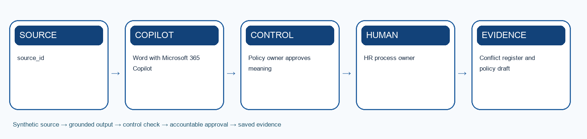

# Lab 7: Draft and Operate an HR Policy Agent

> **Synthetic learning case:** Do not upload live employee or candidate data.

## Scenario

Hybrid-work and conduct guidance exists in conflicting files. HR repeatedly answers the same questions and managers sometimes apply outdated rules.

## Learning goal

Use Word Copilot to reconcile a controlled policy draft, then build an Agent Builder policy Q&A agent that cites the approved version.

## Microsoft tools

- Word with Microsoft 365 Copilot
- Agent Builder in Microsoft 365 Copilot
- SharePoint
- Teams

## Supplied mock data

Use `mock-data.csv` or the **Mock Data** sheet in `Lab-07-Evidence-Workbook.xlsx`. The records are specific to this scenario and carry forward the HarbourLight case.

## Guardrails

- Policy owner approves meaning
- Answers cite effective policy
- Ambiguous and sensitive cases escalate

## Detailed procedure

1. Compare the supplied policy extracts and identify conflicts, gaps and obsolete wording.
2. Confirm the authoritative rule hierarchy with the scenario brief.
3. Use Word Copilot to prepare a plain-language controlled draft.
4. Record approval, effective date, superseded versions and communication plan.
5. Create the Agent Builder purpose, knowledge and response boundaries.
6. Require citations, effective dates, clarification, refusal and escalation.
7. Test normal, ambiguous, outdated-policy and personal-exception questions.
8. Record administrative time saved and the new monitoring workload.

## Product workbench

1. Sign in with the licensed training account. Use only the supplied synthetic `mock-data.csv` or evidence workbook; do not paste live HR records.
2. Open `Lab-07-Evidence-Workbook.xlsx`, inspect the Mock Data sheet and record the meaning of `source_id` and `policy_topic` before prompting.
3. Open Microsoft 365 Copilot in a desktop browser. In the left pane choose New agent; use Describe or Configure to enter a purpose, audience and bounded instructions.
4. On Configure, add only approved training knowledge from SharePoint or OneDrive. Record the exact source title, owner, effective date and access boundary.
5. Create the agent, open it in Copilot and test one normal, one ambiguous, one outdated or unsupported, and one unauthorised request. Save the actual replies and citations.
6. If a reply lacks a citation or exceeds scope, revise the instructions or knowledge set and rerun the same test ID before sharing the agent.

Microsoft product reference: https://learn.microsoft.com/en-us/microsoft-365/copilot/extensibility/agent-templates-overview

## Prompt scaffold

> You are supporting the HarbourLight Logistics SG training case. Use only the supplied synthetic evidence. Your task is to use word copilot to reconcile a controlled policy draft, then build an agent builder policy q&a agent that cites the approved version. State assumptions; cite record IDs or approved source sections; separate observation from inference; flag missing information; list the human checks and approvals required before use.

## Evidence checklist

- [ ] Conflict register and policy draft
- [ ] Agent instructions and knowledge map
- [ ] 8-case test report
- [ ] Evidence workbook records the input/source, prompt or decision, output, verification, revision and owner.
- [ ] A peer or trainer can reproduce the reasoning from the saved evidence.

## Acceptance criteria

- Policy owner approves meaning
- Answers cite effective policy
- Ambiguous and sensitive cases escalate
- The output is accurate, traceable, usable and explicit about uncertainty.
- Consequential decisions and actions remain with an authorised human.

## Scenario questions

1. What makes an answer grounded rather than plausible?
2. Which exception requires a policy owner instead of an agent?
3. What operating work is created when self-service is introduced?

## Submission naming

`L07-<YourName>-Evidence.xlsx` plus the listed deliverables.

## Source anchors

- Course source register: `../SOURCE-COVERAGE.md`
- Microsoft capability boundary: Microsoft 365 Copilot for generative work; Agent Builder or Copilot Studio for agentic work.

## Recommended team roles and timing

- **HR process owner:** confirms that the output solves the stated draft and operate an hr policy agent outcome and remains consistent with approved policy.
- **AI operator or maker:** records the exact prompt, instructions, knowledge sources, tool choices and revisions.
- **Reviewer or approver:** independently checks evidence, permissions, fairness, privacy and any consequential action.
- **Evidence recorder:** keeps the workbook complete enough for another person to reproduce the reasoning.

Allow about 35–50 minutes for the first build, 15 minutes for testing and verification, and 10 minutes for peer challenge and reflection. The trainer may adjust the timing to fit the delivery mode.

## Test-it evidence

Record test ID, input, expected result, actual result, source citation, reviewer and pass/fail in the evidence workbook. For agent labs, use `agent-test-cases.csv` and capture the test conversation or run result before marking a case complete.

## Verification method

1. Compare every factual statement or extracted item with the supplied source record.
2. Mark missing information as unknown; do not convert absence into a negative assumption.
3. Check that personal data, tool access and sharing are limited to the stated purpose.
4. Test one normal case, one ambiguous case, one out-of-scope case and one failure or exception.
5. Ask a peer to challenge the decision, then record whether you accepted or rejected the challenge and why.
6. Confirm the named human owner can correct, stop or reverse the work before submission.

## Troubleshooting and recovery

- If Copilot invents evidence, narrow the prompt to named files, tables or record IDs and request citations.
- If an agent answers outside scope, strengthen instructions, remove inappropriate knowledge or tools, and add an explicit escalation response.
- If a flow fails or repeats an action, do not report success. Preserve the error, check the audit record, use a unique request key, and route the case to the human owner.
- If the output is polished but cannot be traced to evidence, treat it as incomplete and rebuild the evidence chain.
