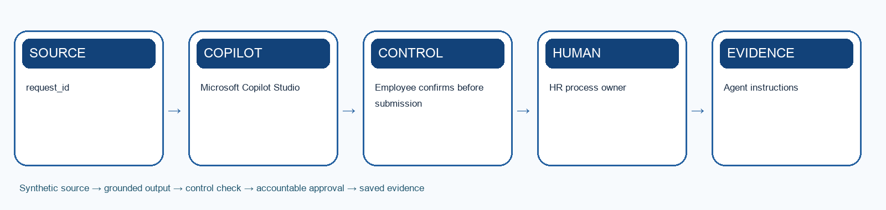

# Lab 8: Automate Leave Application and Approval

> **Synthetic learning case:** Do not upload live employee or candidate data.

## Scenario

Employees message leave dates to HR, which rekeys requests into a tracker and follows up with managers. Balance errors, overlaps and duplicate submissions create avoidable administration.

## Learning goal

Build a Copilot Studio leave agent plus deterministic approval flow for validation, confirmation, update and notification.

## Microsoft tools

- Microsoft Copilot Studio
- Agent flows or Power Automate
- Teams
- Excel or HRIS sandbox

## Supplied mock data

Use `mock-data.csv` or the **Mock Data** sheet in `Lab-08-Evidence-Workbook.xlsx`. The records are specific to this scenario and carry forward the HarbourLight case.

## Guardrails

- Employee confirms before submission
- Manager owns exceptions
- Idempotency prevents duplicate actions

## Detailed procedure

1. Review the approved leave policy, balances, calendars and synthetic requests.
2. Define required inputs, privacy boundaries and validation messages.
3. Design the conversation to clarify dates, leave type, coverage and contact preferences.
4. Create deterministic checks for balance, overlap and approval routing.
5. Add a final employee confirmation before the agent invokes the flow.
6. Write approved, rejected and failed outcomes to the audit log.
7. Test insufficient balance, duplicate request, missing approver and connector failure.
8. Compare old rekeying time with the automated route and document human exceptions.

## Product workbench

1. Sign in with the licensed training account. Use only the supplied synthetic `mock-data.csv` or evidence workbook; do not paste live HR records.
2. Open `Lab-08-Evidence-Workbook.xlsx`, inspect the Mock Data sheet and record the meaning of `request_id` and `employee_id` before prompting.
3. Open Copilot Studio in the approved training environment. Under Agents create a draft agent; set a clear name, purpose, instructions, authentication and escalation boundary.
4. Add only approved synthetic knowledge. If the scenario needs a transaction, create a deterministic flow from Workflows > New agent flow with typed inputs, validation, an approval gate and a status output.
5. For an agent-callable flow use a When an agent calls the flow trigger and Respond to the agent action. Add the published flow as a tool to the draft agent and map each input explicitly.
6. Use the agent Test pane with `agent-test-cases.csv`. Record the test ID, input, expected result, actual reply or tool trace, permission result, reviewer and pass/fail.
7. Do not publish the agent to a broad channel during class. A trainer may allow a private test after all normal, exception, duplicate and connector-failure cases pass.

Microsoft product reference: https://learn.microsoft.com/en-us/microsoft-copilot-studio/flows-overview

## Prompt scaffold

> You are supporting the HarbourLight Logistics SG training case. Use only the supplied synthetic evidence. Your task is to build a copilot studio leave agent plus deterministic approval flow for validation, confirmation, update and notification. State assumptions; cite record IDs or approved source sections; separate observation from inference; flag missing information; list the human checks and approvals required before use.

## Evidence checklist

- [ ] Agent instructions
- [ ] Leave approval flow
- [ ] Audit log and exception test report
- [ ] Evidence workbook records the input/source, prompt or decision, output, verification, revision and owner.
- [ ] A peer or trainer can reproduce the reasoning from the saved evidence.

## Acceptance criteria

- Employee confirms before submission
- Manager owns exceptions
- Idempotency prevents duplicate actions
- The output is accurate, traceable, usable and explicit about uncertainty.
- Consequential decisions and actions remain with an authorised human.

## Scenario questions

1. Which rule belongs in the flow rather than the language model?
2. How will the system detect a duplicate request?
3. Who resolves a disputed leave balance?

## Submission naming

`L08-<YourName>-Evidence.xlsx` plus the listed deliverables.

## Source anchors

- Course source register: `../SOURCE-COVERAGE.md`
- Microsoft capability boundary: Microsoft 365 Copilot for generative work; Agent Builder or Copilot Studio for agentic work.

## Recommended team roles and timing

- **HR process owner:** confirms that the output solves the stated automate leave application and approval outcome and remains consistent with approved policy.
- **AI operator or maker:** records the exact prompt, instructions, knowledge sources, tool choices and revisions.
- **Reviewer or approver:** independently checks evidence, permissions, fairness, privacy and any consequential action.
- **Evidence recorder:** keeps the workbook complete enough for another person to reproduce the reasoning.

Allow about 35–50 minutes for the first build, 15 minutes for testing and verification, and 10 minutes for peer challenge and reflection. The trainer may adjust the timing to fit the delivery mode.

## Test-it evidence

Record test ID, input, expected result, actual result, source citation, reviewer and pass/fail in the evidence workbook. For agent labs, use `agent-test-cases.csv` and capture the test conversation or run result before marking a case complete.

## Verification method

1. Compare every factual statement or extracted item with the supplied source record.
2. Mark missing information as unknown; do not convert absence into a negative assumption.
3. Check that personal data, tool access and sharing are limited to the stated purpose.
4. Test one normal case, one ambiguous case, one out-of-scope case and one failure or exception.
5. Ask a peer to challenge the decision, then record whether you accepted or rejected the challenge and why.
6. Confirm the named human owner can correct, stop or reverse the work before submission.

## Troubleshooting and recovery

- If Copilot invents evidence, narrow the prompt to named files, tables or record IDs and request citations.
- If an agent answers outside scope, strengthen instructions, remove inappropriate knowledge or tools, and add an explicit escalation response.
- If a flow fails or repeats an action, do not report success. Preserve the error, check the audit record, use a unique request key, and route the case to the human owner.
- If the output is polished but cannot be traced to evidence, treat it as incomplete and rebuild the evidence chain.
