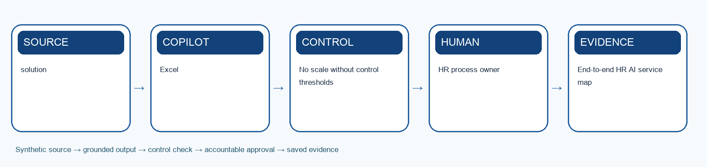

# Lab 12: Capstone: Operate the HR Agent Control Room

> **Synthetic learning case:** Do not upload live employee or candidate data.

## Scenario

HarbourLight now uses generative AI and agents across talent planning, hiring, onboarding, development, policy, leave, benefits, wellness and offboarding. Leaders must decide what to scale, remediate, pause or retire.

## Learning goal

Use lifecycle, service, risk, adoption and human-value evidence to govern the full HR AI operating system.

## Microsoft tools

- Excel
- Teams
- Microsoft 365 Copilot

## Supplied mock data

Use `mock-data.csv` or the **Mock Data** sheet in `Lab-12-Evidence-Workbook.xlsx`. The records are specific to this scenario and carry forward the HarbourLight case.

## Guardrails

- No scale without control thresholds
- Employee feedback included
- Named owner and retirement path

## Detailed procedure

1. Map every activity from talent need to offboarding and identify hand-offs between Copilot, agents, flows and humans.
2. Review the synthetic cycle-time, quality, adoption, escalation, incident and feedback evidence.
3. Validate denominator, baseline, target and trend for each metric.
4. Ask Copilot to summarise evidence with cell references and explicit limitations.
5. Identify control failures, unintended outcomes, administrative work returned and new operating work created.
6. Classify each solution as scale, remediate, pause or retire and respond to the supplied incident.
7. Create a 90-day roadmap with decision gates, accountable owners and retirement paths.
8. Present a three-minute executive recommendation and answer peer challenge questions.

## Product workbench

1. Sign in with the licensed training account. Use only the supplied synthetic `mock-data.csv` or evidence workbook; do not paste live HR records.
2. Open `Lab-12-Evidence-Workbook.xlsx`, inspect the Mock Data sheet and record the meaning of `solution` and `baseline_minutes` before prompting.
3. Save a working copy of the workbook in the approved OneDrive or SharePoint training location. In Excel, make the source range a named Table with headers, then open Copilot from the ribbon.
4. Ask Copilot to use the named table and cite `solution` for each finding. Request an output table with evidence, uncertainty and an HR reviewer action.
5. Compare at least three claims with the original CSV rows. Write corrections and the exact prompt in the Evidence Log; do not treat a Copilot chart or summary as a final decision.

Microsoft product reference: https://support.microsoft.com/en-us/copilot-excel

## Prompt scaffold

> You are supporting the HarbourLight Logistics SG training case. Use only the supplied synthetic evidence. Your task is to use lifecycle, service, risk, adoption and human-value evidence to govern the full hr ai operating system. State assumptions; cite record IDs or approved source sections; separate observation from inference; flag missing information; list the human checks and approvals required before use.

## Evidence checklist

- [ ] End-to-end HR AI service map
- [ ] Agent scorecard and incident response
- [ ] 90-day roadmap and executive recommendation
- [ ] Evidence workbook records the input/source, prompt or decision, output, verification, revision and owner.
- [ ] A peer or trainer can reproduce the reasoning from the saved evidence.

## Acceptance criteria

- No scale without control thresholds
- Employee feedback included
- Named owner and retirement path
- The output is accurate, traceable, usable and explicit about uncertainty.
- Consequential decisions and actions remain with an authorised human.

## Scenario questions

1. Which metric looked good but hid harm?
2. What evidence justifies scale?
3. How will the organisation retire an agent safely?

## Submission naming

`L12-<YourName>-Evidence.xlsx` plus the listed deliverables.

## Source anchors

- Course source register: `../SOURCE-COVERAGE.md`
- Microsoft capability boundary: Microsoft 365 Copilot for generative work; Agent Builder or Copilot Studio for agentic work.

## Recommended team roles and timing

- **HR process owner:** confirms that the output solves the stated capstone: operate the hr agent control room outcome and remains consistent with approved policy.
- **AI operator or maker:** records the exact prompt, instructions, knowledge sources, tool choices and revisions.
- **Reviewer or approver:** independently checks evidence, permissions, fairness, privacy and any consequential action.
- **Evidence recorder:** keeps the workbook complete enough for another person to reproduce the reasoning.

Allow about 35–50 minutes for the first build, 15 minutes for testing and verification, and 10 minutes for peer challenge and reflection. The trainer may adjust the timing to fit the delivery mode.

## Test-it evidence

Record test ID, input, expected result, actual result, source citation, reviewer and pass/fail in the evidence workbook. For agent labs, use `agent-test-cases.csv` and capture the test conversation or run result before marking a case complete.

## Verification method

1. Compare every factual statement or extracted item with the supplied source record.
2. Mark missing information as unknown; do not convert absence into a negative assumption.
3. Check that personal data, tool access and sharing are limited to the stated purpose.
4. Test one normal case, one ambiguous case, one out-of-scope case and one failure or exception.
5. Ask a peer to challenge the decision, then record whether you accepted or rejected the challenge and why.
6. Confirm the named human owner can correct, stop or reverse the work before submission.

## Troubleshooting and recovery

- If Copilot invents evidence, narrow the prompt to named files, tables or record IDs and request citations.
- If an agent answers outside scope, strengthen instructions, remove inappropriate knowledge or tools, and add an explicit escalation response.
- If a flow fails or repeats an action, do not report success. Preserve the error, check the audit record, use a unique request key, and route the case to the human owner.
- If the output is polished but cannot be traced to evidence, treat it as incomplete and rebuild the evidence chain.
